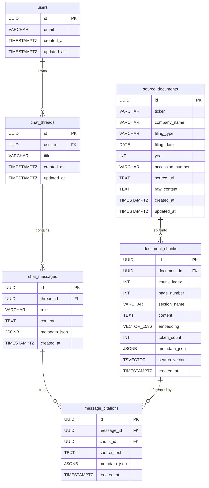

# Document Copilot Backend

This is the Python + FastAPI backend for the Document Copilot project. It manages document processing, retrieval logic (using hybrid Postgres full-text and `pgvector` search), and LLM orchestration through PydanticAI.

---

## Prerequisites

Before setting up the project, ensure you have the following installed on your system:
* **Python 3.12 or higher**
* **[uv](https://docs.astral.sh/uv/)** (Fast Python package installer and resolver)

---

## Quick Start Setup

Follow these steps to configure your environment and run the backend locally:

### 1. Synchronize Dependencies
The project relies on `uv` to manage the virtual environment and lock files. Sync all required dependencies and install the local `app` module in editable mode:
```bash
# Navigate to the backend directory
cd backend

# Synchronize dependencies and prepare the venv
uv sync
```

### 2. Configure Environment Variables
Copy the example environment file and configure the settings with your own values:
```bash
copy .env.example .env
```

Open `.env` and fill in the configuration options:
* **Supabase Configuration:** Set `SUPABASE_URL`, `SUPABASE_ANON_KEY`, and `SUPABASE_SERVICE_ROLE_KEY`.
* **Database Connection:** Set `DATABASE_URL` (direct session connection required for running schema migrations).
* **LLM API Keys:**
  * Define `GOOGLE_API_KEY`, `GEMINI_EMBEDDING_MODEL`, and `GEMINI_EMBEDDING_DIMENSIONS` to use Gemini.
  * Define `OPENAI_API_KEY`, `OPENAI_EMBEDDING_MODEL`, and `OPENAI_EMBEDDING_DIMENSIONS` if using OpenAI.
* **Server CORS Settings:** Configure `ALLOWED_ORIGINS` with a comma-separated list of origins allowed to call this API (e.g. `http://localhost:5173`).

---

## Database Schema

The schema consists of six tables managed by SQLAlchemy models (under `app/database/models/`) and applied via Alembic migrations.

### Entity-Relationship Diagram



### Model files

| File | Table | Description |
|------|-------|-------------|
| `models/user.py` | `users` | Authenticated user, keyed by Supabase `auth.users.id` |
| `models/document.py` | `source_documents` | SEC filing document with metadata |
| `models/chunk.py` | `document_chunks` | Text passage with `pgvector` embedding + GIN full-text index |
| `models/thread.py` | `chat_threads` | Conversation thread owned by a user |
| `models/message.py` | `chat_messages` | Individual `user` or `assistant` message inside a thread |
| `models/citation.py` | `message_citations` | Cited passage linking an assistant message to a chunk |

---

## Database Migrations

Schema changes are managed with Alembic. `alembic/env.py` imports `Base` from `app.database.models`, so it automatically detects all model changes.

### Apply all pending migrations
```bash
uv run alembic upgrade head
```

### Generate a new migration after editing a model
```bash
uv run alembic revision --autogenerate -m "describe change"
```

> **Note:** Always review the generated file in `alembic/versions/` before applying. Add explicit `op.execute()` calls for Postgres-specific features (extensions, generated columns, HNSW/GIN indexes, RLS policies) that Alembic autogenerate cannot infer reliably.

---

## Running the Development Server

Start the API development server using Uvicorn with auto-reload enabled:
```bash
uv run uvicorn app.main:app --reload
```

The server runs on **`http://127.0.0.1:8000`** by default.

---

## Verifying the Setup

* **Health Check Endpoint:** Visit [http://127.0.0.1:8000/healthz](http://127.0.0.1:8000/healthz) to ensure settings are parsed and the backend is running.
* **Interactive API Documentation:** Visit [http://127.0.0.1:8000/docs](http://127.0.0.1:8000/docs) (Swagger UI) or [http://127.0.0.1:8000/redoc](http://127.0.0.1:8000/redoc) (ReDoc) to interact with the API endpoints.

---

## Running Directly (Alternative)
You can also launch the server directly using Python. Since `uv sync` installs the `app` in editable mode, executing the module is straightforward:
```bash
uv run python app/main.py
```
